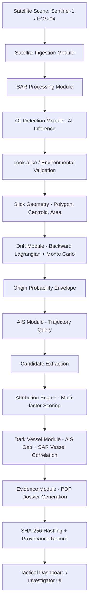
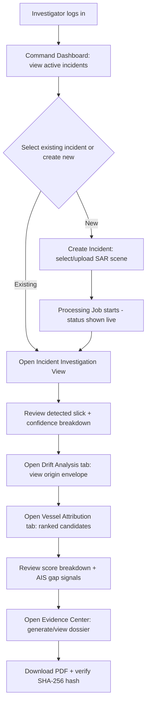
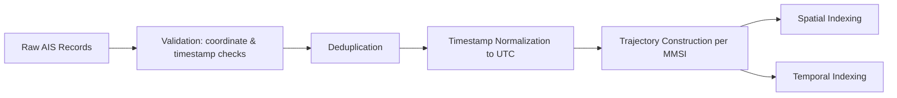
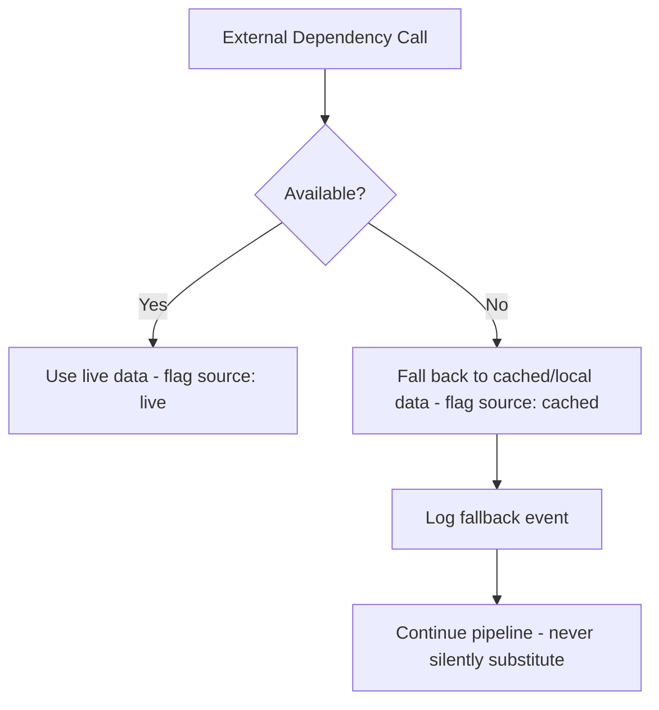

# Spill Sense — Application Flow

**Project:** Spill Sense · **Team:** BUG STALKERS · **SIH26143**
**Companion documents:** `prd.md`, `tech_stack.md`, `design.md`, `schema.md`, `implementationPlan.md`, `Tracker.md`, `rules.md`

This document is the authoritative description of **how data moves through Spill Sense**, from a raw SAR scene to a hashed evidence dossier. It is written so the coding agent can implement each transformation without inventing intermediate steps.

---

## 1. System Flow (High Level)



This is the concrete realization of the conceptual pipeline: **DETECT (B–F) → TRACE BACK (G–H) → ATTRIBUTE (I–L) → PROVE (M–N)**.

---

## 2. User Flow



---

## 3. Incident Creation

**Trigger:** Investigator selects "New Incident" or the system ingests a new curated/demo scene.

**Inputs:** SAR scene reference (live download or local/cached file), optional investigator-supplied metadata (region of interest, notes).

**Process:**
1. API `POST /api/v1/incidents` creates an `incidents` record with status `created`.
2. A `processing_jobs` record is created, linked to the incident, status `queued`.
3. The Satellite Ingestion module is triggered asynchronously (Celery task).

**Output:** Incident ID returned to the frontend; job status streamed via WebSocket/polling.

---

## 4. Satellite Ingestion

**Inputs:** Scene identifier or file path; source flag (`copernicus`, `bhoonidhi`, `cached_demo`).

**Process:**
1. Validate scene metadata (acquisition time, footprint, product type — GRD vs SLC).
2. If **Live Mode**: authenticate against Copernicus Data Space Ecosystem (or Bhoonidhi) and download the product.
3. If **Demo Mode**: load the pre-staged scene from local/MinIO storage — no external network call.
4. Store raw scene reference in `satellite_scenes`; register the raster file in `raster_assets` with its file hash.

**Output:** A validated, locally available SAR raster ready for preprocessing.

**Failure handling:** See §14 Error Handling.

---

## 5. SAR Processing

**Inputs:** Raw/GRD SAR raster from Satellite Ingestion.

**Process:**
1. Radiometric normalization (use Copernicus pre-calibrated GRD values as baseline; full SNAP-based recalibration is P2 per `tech_stack.md`).
2. Speckle-noise handling (OpenCV filtering).
3. Geospatial normalization — reproject to the project's canonical working CRS (see `schema.md` §CRS).
4. Tile the scene if required for model input size constraints.

**Output:** A normalized raster array ready for AI inference, plus updated `raster_assets` metadata (preprocessing version).

---

## 6. Oil Detection (AI Inference)

**Inputs:** Normalized SAR raster tiles.

**Process:**
1. Load the versioned U-Net (ResNet-50 encoder) model (see `schema.md` §model_versions).
2. Run inference per tile; reassemble into a full-scene probability map.
3. Threshold the probability map into a binary candidate mask.
4. Post-process (morphological opening/closing) to remove noise-sized artifacts.
5. Vectorize the mask into polygon(s) (Shapely), reprojecting pixel coordinates to geographic coordinates.
6. Compute centroid, bounding box, area (geodesic), and perimeter for each candidate polygon.
7. Attach the raw segmentation confidence score.

**Output:** One or more `oil_spills` candidate records per incident, each with geometry + raw confidence + model version.

---

## 7. Look-alike Validation

**Inputs:** Candidate slick polygon(s), detection time/location, environmental data (wind speed at minimum).

**Process (documented, reproducible formula):**

```
environmental_compatibility = f(wind_speed_at_detection, historical_lookalike_rates_for_conditions)
look_alike_risk            = g(sar_artifact_signals, shape_regularity, wind_context)
final_confidence            = segmentation_confidence
                               * environmental_compatibility
                               * (1 - look_alike_risk)
```

The exact functional forms of `f` and `g` are configuration-driven (not hardcoded magic numbers) and must be documented in the model/README as they are tuned during Phase 5 — this avoids inventing unsupported thresholds (PRD §13, `rules.md` §AI).

Example conceptual output (illustrative, not a validated production formula):
```
Detection confidence:        0.88
Environmental compatibility: 0.77
Look-alike risk:              0.21
Final confidence:             0.81
```

**Output:** Updated `oil_spills` record with `final_confidence`, `environmental_compatibility`, and `look_alike_risk` fields populated.

---

## 8. Slick Geometry Finalization

The finalized geometry (post-validation) becomes the authoritative slick polygon used downstream by the Drift module. No further geometric changes occur after this step without a new processing run.

---

## 9. Drift Hindcasting (Trace Back)

**Inputs:** Finalized slick polygon, detection timestamp, environmental forcing (currents: INCOIS/CMEMS; winds: ERA5).

**Process:**
1. Initialize N particles within the slick polygon at detection time T (`drift_runs` + `drift_particles` created).
2. Configure OpenDrift/OpenOil with: simulation duration (backward), timestep, windage coefficient, stochastic dispersion/perturbation parameters — all recorded against the `drift_runs` record.
3. Run the simulation backward in time from T to T-Δ (Δ documented per run; not assumed fixed).
4. Apply Monte Carlo perturbation across multiple simulation members to represent uncertainty.
5. Collect final particle positions (the "oldest" backward state per member).

**Output:** A particle distribution stored in `drift_particles`, linked to the `drift_runs` record with full parameter provenance (FR-T5).

**Failure handling:** If live current/wind forcing is unavailable, fall back to the most recent cached forcing dataset and flag the run as `forcing_source: cached` (see §14/§16).

---

## 10. Monte Carlo Origin Modeling

**Inputs:** Particle distribution from §9.

**Process:**
1. Compute a spatial density/probability surface from the particle distribution (e.g., kernel density estimation).
2. Derive probability contours at defined bands (high / medium / low).
3. Convert contours into `origin_envelopes` polygon/multipolygon records (or raster reference, per `schema.md` decision).

**Output:** One `origin_envelopes` record per `drift_runs`, with explicit probability bands — never a single point (FR-T6).

---

## 11. AIS Ingestion

**Inputs:** Raw AIS records (live GFW/MarineCadastre feed, or cached/local dataset in Demo Mode).

**Process:**


**Output:** Indexed `ais_positions` and derived vessel trajectories, ready for spatio-temporal querying.

---

## 12. Candidate Extraction

**Inputs:** `origin_envelopes` geometry + time window; indexed AIS trajectories.

**Process:**
1. Spatial query: which vessel trajectories intersect the origin envelope geometry.
2. Temporal filter: restrict to positions within the relevant time window around the estimated origin time.
3. Produce a candidate list (`vessel_candidates`) per incident.

**Output:** Raw candidate vessel set, not yet scored.

---

## 13. Attribution (Multi-Factor Scoring)

**Inputs:** Candidate vessel trajectories, origin envelope, drift run metadata.

**Process — documented, configurable formula:**

```
spatial_match        = normalized(time_spent_in_envelope, distance_to_probable_origin)
temporal_match        = normalized(overlap between vessel presence window and origin time window)
trajectory_alignment  = normalized(heading/course compatibility with drift-implied source direction)
behavior_signal       = normalized(speed changes, course changes near origin time)
ais_continuity        = normalized(AIS completeness / inverse of suspicious gap frequency)

overall_score = w1*spatial_match + w2*temporal_match + w3*trajectory_alignment
              + w4*behavior_signal + w5*ais_continuity
```

Weights (`w1..w5`) are configuration values documented alongside the scoring module, not hardcoded inline magic numbers — enabling tuning without code changes (`rules.md` §AI, §Drift analog for attribution).

Example conceptual output (illustrative only):
```
Spatial Match         0.92
Temporal Match        0.87
Trajectory Alignment  0.84
Behavior Signal       0.61
AIS Continuity        0.95
Overall Score         0.85
```

**Output:** `attribution_scores` records, one per candidate vessel per incident, ranked by `overall_score`. Labeled as **candidate vessels**, never "the responsible vessel" (FR-A4).

---

## 14. Dark Vessel Analysis

### 14.1 AIS Gap Analysis
1. Scan each candidate/nearby vessel's AIS trajectory for transmission gaps.
2. Classify each gap: `normal` (short, explainable by known coverage limits) / `uncertain` (moderate duration, no clear explanation) / `suspicious` (occurs near the origin envelope in space and time, longer than expected).
3. Store as `ais_gaps` records linked to the vessel and incident.

### 14.2 SAR-Based Vessel Detection
1. Run SAR target-extraction (CFAR or equivalent — see `tech_stack.md` for MVP-realistic approach) on the same SAR scene used for detection.
2. Compare detected SAR targets' positions/times against known AIS positions.
3. Classify each SAR target as `ais_present` (correlated with a known AIS track) or `ais_missing` (no correlating AIS track) — a **potential dark-vessel signal**, not a conclusion.

**Output:** Dark-vessel signals surfacing inside the attribution breakdown (FR-V3), never as a standalone accusation.

---

## 15. Evidence Generation (Prove)

**Inputs:** All incident artifacts — slick geometry, confidence breakdown, drift run + origin envelope, candidate vessels + scores, dark-vessel signals, supporting map images.

**Process:**
1. Assemble a structured evidence payload from the database (per `schema.md` §evidence_artifacts).
2. Render the PDF dossier (see PRD §11.6 for required contents).
3. Compute SHA-256 hash of the PDF and of key underlying artifacts (raster, model output).
4. Store hash + provenance chain (`evidence_artifacts`, `reports`).

**Output:** A downloadable, hash-verifiable PDF dossier, explicitly labeled to distinguish **integrity** from **legal admissibility** (FR-E3).

---

## 16. Notifications

- **P0 (MVP):** In-app job-status updates (queued → running → completed/failed) shown on the Command Dashboard and Incident Investigation View.
- **P1:** WebSocket-pushed live progress percentage for long-running jobs (drift simulation, PDF generation).
- **P3 (future):** External SMS/email notification via Twilio/SendGrid for incident status changes.

---

## 17. Error Handling



| Dependency | Failure mode | Fallback |
|---|---|---|
| Copernicus Data Space Ecosystem | Unreachable / rate-limited | Cached SAR scene (Demo Mode asset) |
| ISRO Bhoonidhi | Unreachable / access restricted | Cached SAR scene, or Copernicus Sentinel-1 substitute |
| INCOIS currents | Unreachable | CMEMS current data |
| CMEMS / ERA5 | Unreachable | Previously cached forcing dataset for the demo scenario |
| AIS live source (GFW/MarineCadastre) | Unreachable | Local historical/cached AIS dataset |
| ML inference service | Unavailable (e.g., GPU/model load failure) | Preloaded model artifact / controlled demo-mode cached inference result |
| PDF generation | Rendering failure | Retry once; surface job as `failed` with error detail — never fabricate a dossier |

**Rule:** every fallback event is recorded and surfaced in the UI/API response (`data_source: live | cached`). The system never silently pretends live data was used (PRD §35, `rules.md`).

---

## 18. Demo Mode

Demo Mode uses exclusively pre-staged, validated inputs:
- One curated SAR scene (with known, pre-validated expected detection output).
- Cached environmental forcing files (currents + wind) for the scene's time window.
- A prepared, cached AIS dataset covering the demo scenario's spatial/temporal window.
- Preloaded model artifacts (no live model download).

Demo Mode is functionally and visually identical to Live/Research Mode — the only difference is the data source, which is explicitly labeled in the UI (e.g., a small "Demo Mode / cached data" indicator).

---

## 19. Live / Research Mode

Live Mode is architecturally identical but sources data from:
- Copernicus Data Space Ecosystem / ISRO Bhoonidhi (satellite imagery),
- CMEMS / INCOIS / ERA5 (environmental forcing),
- Global Fishing Watch / MarineCadastre (AIS).

The same domain modules and API contracts serve both modes — Live Mode simply swaps the data-source adapter (see `tech_stack.md` §Architectural Philosophy for the modular domain-module design that enables this).
