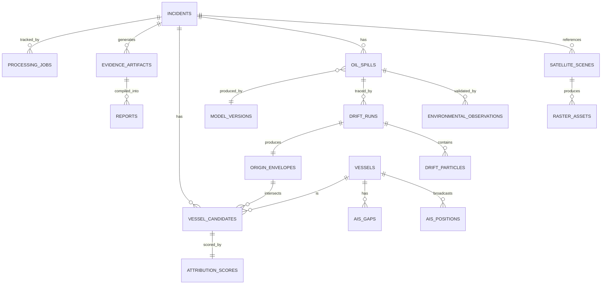

# Spill Sense — Data Architecture & Schema

**Project:** Spill Sense · **Team:** BUG STALKERS · **SIH26143**
**Companion documents:** `prd.md`, `tech_stack.md`, `AppFlow.md`, `design.md`, `implementationPlan.md`, `Tracker.md`, `rules.md`

Primary operational database: **PostgreSQL + PostGIS**. Analytical/batch engine: **DuckDB Spatial** (P1, large AIS scans). Object storage: **MinIO/S3** for rasters and PDFs (referenced by URI, not stored as blobs in Postgres).

---

## 1. Coordinate Reference System (CRS) Standard

- **Storage CRS (all geometry columns):** `SRID 4326` (WGS 84) — canonical storage format for interoperability with GeoJSON and external APIs.
- **Calculation CRS:** geodesic calculations use PostGIS `geography` type (or explicit `ST_Transform` to an appropriate equal-area/equidistant projection, e.g., a regional UTM zone or World Azimuthal Equidistant centered on the incident) for area/distance/perimeter — **never** raw degree-based planar math on `geometry` in 4326 (PRD §14, §23).
- **Raster CRS:** SAR rasters retain their native product CRS during processing; reprojected to 4326 only at the point of vectorization/publication for map display.
- **Rule:** every table storing computed distance/area values documents which CRS/method produced that value in its own column comment or a `calculation_method` field where ambiguity is possible.

---

## 2. Time Standard

- All timestamps stored as `TIMESTAMPTZ` in **UTC**.
- Satellite acquisition time, AIS timestamps, environmental data timestamps, and drift simulation time all normalize to UTC at ingestion — never mixed with local time (PRD §24).
- Uncertainty windows (e.g., origin time envelope) are stored as an explicit `(earliest, latest)` pair, not a single timestamp with an implied tolerance.

---

## 3. Entity-Relationship Diagram

---

## 4. Table Definitions

### 4.1 `incidents`
| Column | Type | Notes |
|---|---|---|
| `id` | UUID PK | |
| `status` | ENUM(`created`,`processing`,`detected`,`traced`,`attributed`,`evidence_ready`,`failed`) | |
| `severity` | ENUM(`low`,`medium`,`high`) | Derived, not investigator-asserted certainty |
| `created_at` / `updated_at` | TIMESTAMPTZ | UTC |
| `region_of_interest` | GEOMETRY(Polygon, 4326) | Optional, investigator-defined |
| `mode` | ENUM(`demo`,`live`) | Which data-source mode produced this incident (`AppFlow.md` §18–19) |
| `notes` | TEXT | Free-text investigator notes |

Indexes: GiST on `region_of_interest`; B-tree on `status`, `created_at`.

### 4.2 `satellite_scenes`
| Column | Type | Notes |
|---|---|---|
| `id` | UUID PK | |
| `incident_id` | UUID FK → incidents | |
| `source` | ENUM(`copernicus`,`bhoonidhi`,`cached_demo`) | |
| `scene_identifier` | TEXT | Provider's native scene/product ID |
| `product_type` | ENUM(`GRD`,`SLC`) | |
| `acquisition_time` | TIMESTAMPTZ | UTC |
| `footprint` | GEOMETRY(Polygon, 4326) | Scene spatial extent |
| `file_hash` | TEXT | SHA-256 of the raw downloaded/cached product |

Indexes: GiST on `footprint`; B-tree on `acquisition_time`.

### 4.3 `raster_assets`
| Column | Type | Notes |
|---|---|---|
| `id` | UUID PK | |
| `scene_id` | UUID FK → satellite_scenes | |
| `stage` | ENUM(`raw`,`calibrated`,`normalized`,`mask`) | Which pipeline stage this raster represents |
| `storage_uri` | TEXT | MinIO/S3 object reference |
| `file_hash` | TEXT | SHA-256 |
| `crs` | TEXT | Native CRS of this raster |
| `preprocessing_version` | TEXT | Links to versioning scheme, `tech_stack.md`/`model_versions` |

### 4.4 `oil_spills`
| Column | Type | Notes |
|---|---|---|
| `id` | UUID PK | |
| `incident_id` | UUID FK → incidents | |
| `scene_id` | UUID FK → satellite_scenes | |
| `geometry` | GEOMETRY(MultiPolygon, 4326) | Vectorized slick polygon |
| `centroid` | GEOGRAPHY(Point, 4326) | |
| `bounding_box` | GEOMETRY(Polygon, 4326) | |
| `area_sq_km` | NUMERIC | Computed geodesically — see §1 |
| `perimeter_km` | NUMERIC | Computed geodesically |
| `segmentation_confidence` | NUMERIC(3,2) | Raw model output, 0–1 |
| `environmental_compatibility` | NUMERIC(3,2) | From look-alike validation, `AppFlow.md` §7 |
| `look_alike_risk` | NUMERIC(3,2) | |
| `final_confidence` | NUMERIC(3,2) | |
| `model_version_id` | UUID FK → model_versions | |
| `detected_at` | TIMESTAMPTZ | Scene acquisition time (the observation time T) |

Indexes: GiST on `geometry`, `centroid`, `bounding_box`; B-tree on `incident_id`, `detected_at`.

### 4.5 `environmental_observations`
| Column | Type | Notes |
|---|---|---|
| `id` | UUID PK | |
| `oil_spill_id` | UUID FK → oil_spills | |
| `source` | ENUM(`incois`,`cmems`,`era5`,`open_meteo`,`cached`) | |
| `observation_time` | TIMESTAMPTZ | |
| `wind_speed_ms` | NUMERIC | |
| `wind_direction_deg` | NUMERIC | |
| `current_speed_ms` | NUMERIC | |
| `current_direction_deg` | NUMERIC | |
| `data_source_flag` | ENUM(`live`,`cached`) | Explicit fallback marker per `AppFlow.md` §17 |

### 4.6 `drift_runs`
| Column | Type | Notes |
|---|---|---|
| `id` | UUID PK | |
| `oil_spill_id` | UUID FK → oil_spills | |
| `simulation_start` / `simulation_end` | TIMESTAMPTZ | Backward window bounds |
| `timestep_seconds` | INTEGER | |
| `particle_count` | INTEGER | |
| `windage_coefficient` | NUMERIC | |
| `perturbation_model` | TEXT | Description/name of the stochastic model used |
| `forcing_current_source` | ENUM(`incois`,`cmems`,`cached`) | |
| `forcing_wind_source` | ENUM(`era5`,`open_meteo`,`cached`) | |
| `data_source_flag` | ENUM(`live`,`cached`) | |
| `software_version` | TEXT | OpenDrift version + config hash |
| `status` | ENUM(`queued`,`running`,`completed`,`failed`) | |
| `created_at` | TIMESTAMPTZ | |

### 4.7 `drift_particles`
| Column | Type | Notes |
|---|---|---|
| `id` | UUID PK | |
| `drift_run_id` | UUID FK → drift_runs | |
| `member_index` | INTEGER | Monte Carlo member/realization number |
| `final_position` | GEOGRAPHY(Point, 4326) | Backward-traced terminal position |
| `final_time` | TIMESTAMPTZ | |

Indexes: GiST on `final_position`; B-tree on `drift_run_id`.
Note: only terminal positions are persisted per particle for MVP storage efficiency; full trajectory paths may be retained as a P2 enhancement if disk/query budget allows.

### 4.8 `origin_envelopes`
| Column | Type | Notes |
|---|---|---|
| `id` | UUID PK | |
| `drift_run_id` | UUID FK → drift_runs | |
| `probability_band` | ENUM(`high`,`medium`,`low`) | One row per band |
| `geometry` | GEOMETRY(MultiPolygon, 4326) | Contour polygon for this band |
| `probability_threshold` | NUMERIC(3,2) | Density threshold defining this band's boundary |

Indexes: GiST on `geometry`.

### 4.9 `vessels`
| Column | Type | Notes |
|---|---|---|
| `id` | UUID PK | |
| `mmsi` | TEXT | |
| `imo_number` | TEXT | Nullable — not always available |
| `vessel_name` | TEXT | |
| `vessel_type` | TEXT | |
| `data_source` | ENUM(`marinecadastre`,`gfw`,`cached`) | |

Indexes: B-tree/unique on `mmsi`.

### 4.10 `ais_positions`
| Column | Type | Notes |
|---|---|---|
| `id` | BIGSERIAL PK | High-volume table — surrogate integer key |
| `vessel_id` | UUID FK → vessels | |
| `position` | GEOGRAPHY(Point, 4326) | |
| `timestamp` | TIMESTAMPTZ | UTC, normalized |
| `speed_over_ground` | NUMERIC | |
| `course_over_ground` | NUMERIC | |
| `heading` | NUMERIC | |
| `navigational_status` | TEXT | |

Indexes: **GiST on `position`, B-tree (or BRIN for very large tables) on `timestamp`, composite index on `(vessel_id, timestamp)`.** This table is explicitly designed for high volume — no unindexed scans (PRD §22).

### 4.11 `ais_gaps`
| Column | Type | Notes |
|---|---|---|
| `id` | UUID PK | |
| `vessel_id` | UUID FK → vessels | |
| `incident_id` | UUID FK → incidents (nullable) | Set when the gap is evaluated in the context of a specific incident |
| `gap_start` / `gap_end` | TIMESTAMPTZ | |
| `classification` | ENUM(`normal`,`uncertain`,`suspicious`) | Per `AppFlow.md` §14.1 |
| `last_known_position` | GEOGRAPHY(Point, 4326) | |
| `reappearance_position` | GEOGRAPHY(Point, 4326) | Nullable if vessel has not reappeared |

### 4.12 `vessel_candidates`
| Column | Type | Notes |
|---|---|---|
| `id` | UUID PK | |
| `incident_id` | UUID FK → incidents | |
| `vessel_id` | UUID FK → vessels | |
| `origin_envelope_id` | UUID FK → origin_envelopes | |
| `extracted_at` | TIMESTAMPTZ | |

### 4.13 `attribution_scores`
| Column | Type | Notes |
|---|---|---|
| `id` | UUID PK | |
| `vessel_candidate_id` | UUID FK → vessel_candidates (unique) | |
| `spatial_match` | NUMERIC(3,2) | |
| `temporal_match` | NUMERIC(3,2) | |
| `trajectory_alignment` | NUMERIC(3,2) | |
| `behavior_signal` | NUMERIC(3,2) | |
| `ais_continuity` | NUMERIC(3,2) | |
| `overall_score` | NUMERIC(3,2) | |
| `scoring_config_version` | TEXT | Points to the weights/formula version used (`AppFlow.md` §13) |
| `rank` | INTEGER | Rank within the incident's candidate list |

### 4.14 `evidence_artifacts`
| Column | Type | Notes |
|---|---|---|
| `id` | UUID PK | |
| `incident_id` | UUID FK → incidents | |
| `artifact_type` | ENUM(`pdf_dossier`,`map_image`,`raw_data_export`) | |
| `storage_uri` | TEXT | |
| `sha256_hash` | TEXT | |
| `generated_at` | TIMESTAMPTZ | |
| `provenance` | JSONB | Structured record of source datasets/versions used — JSON justified here because provenance shape varies by artifact type |

### 4.15 `reports`
| Column | Type | Notes |
|---|---|---|
| `id` | UUID PK | |
| `incident_id` | UUID FK → incidents | |
| `evidence_artifact_id` | UUID FK → evidence_artifacts | The compiled PDF dossier record |
| `software_version` | TEXT | |
| `model_versions_snapshot` | JSONB | Snapshot of all model/dataset versions used, for reproducibility |
| `generated_at` | TIMESTAMPTZ | |

### 4.16 `processing_jobs`
| Column | Type | Notes |
|---|---|---|
| `id` | UUID PK | |
| `incident_id` | UUID FK → incidents | |
| `job_type` | ENUM(`ingestion`,`sar_processing`,`inference`,`drift_simulation`,`ais_analysis`,`evidence_generation`) | |
| `status` | ENUM(`queued`,`running`,`completed`,`failed`,`cancelled`) | |
| `progress_pct` | INTEGER | |
| `error_message` | TEXT | Nullable |
| `started_at` / `completed_at` | TIMESTAMPTZ | |

Indexes: B-tree on `(incident_id, status)`.

### 4.17 `model_versions`
| Column | Type | Notes |
|---|---|---|
| `id` | UUID PK | |
| `component` | ENUM(`segmentation_model`,`lookalike_scoring`,`drift_config`,`attribution_scoring`,`ais_pipeline`,`software_release`) | Matches PRD §59 versioning categories |
| `version_label` | TEXT | Semantic or hash-based version identifier |
| `git_commit` | TEXT | Nullable — where practical |
| `created_at` | TIMESTAMPTZ | |
| `notes` | TEXT | |

---

## 5. Enums Summary

Centralized as native PostgreSQL `ENUM` types (or `CHECK` constraints where a lighter-weight approach is preferred) so invalid states are rejected at the database layer, not just the application layer: incident `status`/`severity`/`mode`, job `status`/`job_type`, AIS-gap `classification`, origin-envelope `probability_band`, data-source flags (`live`/`cached`).

---

## 6. Constraints & Provenance

- All foreign keys `ON DELETE RESTRICT` by default for evidence-relevant tables (`oil_spills`, `drift_runs`, `attribution_scores`, `evidence_artifacts`) — an incident's evidentiary chain must never silently cascade-delete.
- Every analytically significant table carries enough fields to answer "what produced this value and when" without joining more than two tables — directly supporting PRD §21 Data Provenance.
- `JSONB` is used only where the shape is genuinely variable (`provenance`, `model_versions_snapshot`) — not as a general-purpose escape hatch for structured data that belongs in typed columns.

---

## 7. Database ↔ API Relationship

- Every `/api/v1/*` resource in `prd.md`/`AppFlow.md` maps to one or more tables above; the API layer never exposes raw database column names it hasn't explicitly chosen to (Pydantic response models control the contract).
- Geometry columns are serialized to GeoJSON at the API boundary (via GeoAlchemy2 → Shapely → `mapping()`), keeping PostGIS-specific types out of the frontend entirely.
- Async job tables (`processing_jobs`) back every long-running endpoint described in `AppFlow.md`/`prd.md` §26 — the API never blocks on SAR/drift/AIS/PDF work.
